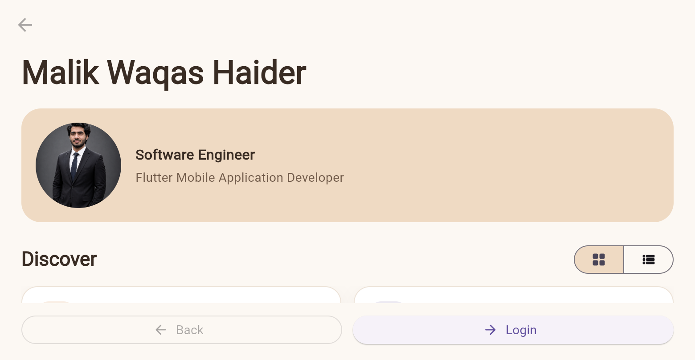
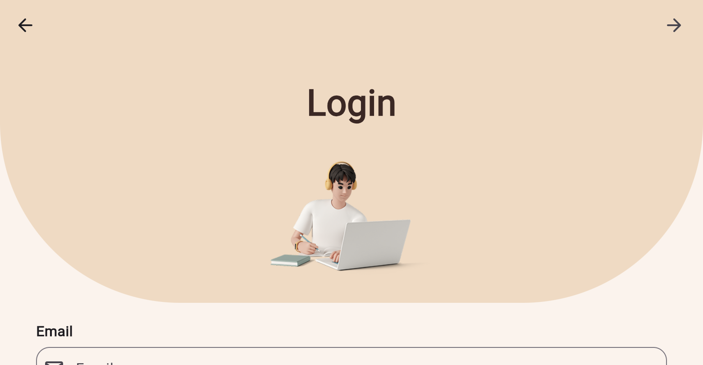
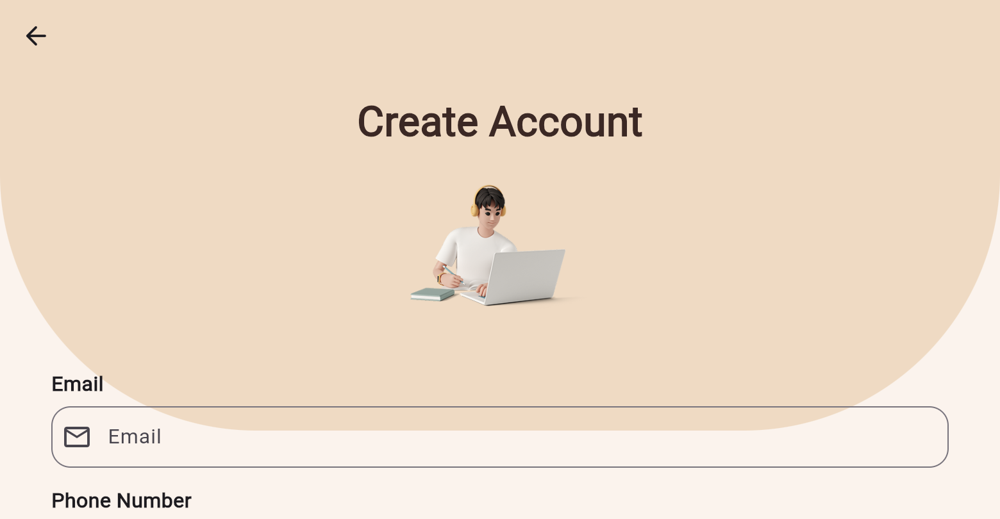

# Malik Waqas Haider | Flutter Portfolio App

A polished Flutter portfolio and authentication experience for **Malik Waqas Haider**, a Software Engineer and Flutter Mobile Application Developer from Pakistan.

The app opens with a personal portfolio home screen, then guides visitors through Login and Signup screens with clear forward and backward navigation.

## Highlights

- Professional portfolio-style Home screen.
- Circular, face-focused profile image from `assets/images/Waqas.png`.
- Grid and list views for portfolio content.
- Project showcase for Pocket Ledger, Sky Pulse, and Job Tracker.
- Email contact action for project enquiries.
- Responsive Login and Signup experiences.
- Form validation for email, phone, and password fields.
- Password visibility controls and forgot-password flow.
- Social sign-in action buttons.
- Layouts designed for smaller screens without bottom overflow.

## App Flow

```text
Home -> Login -> Signup
	^       ^       |
	|       +-------+
	+---------------+
```

## Screenshots

Screenshots are stored in [`screenshots/`](screenshots/).

| Home | Login | Signup |
| --- | --- | --- |
|  |  |  |

The iPhone 16 simulator capture is also available as [`home-ios.png`](screenshots/home-ios.png).

## Download APK

Download the latest checked-in Android build: [Login_Screen.apk](releases/Login_Screen.apk).

Build a fresh release APK locally with:

```bash
flutter build apk --release
```

The generated file is available at:

```text
build/app/outputs/flutter-apk/app-release.apk
```

The distributable APK is also kept in `releases/Login_Screen.apk` for quick testing.

## Run Locally

Requirements: Flutter SDK 3.13.2 or newer and a connected device or emulator.

```bash
flutter pub get
flutter run
```

## Verify

```bash
flutter analyze
flutter test
```

## Project Structure

- `lib/main.dart` - Application entry point and theme.
- `lib/screens/home_screen.dart` - Portfolio Home screen, project showcase, and contact action.
- `lib/screens/login_screen.dart` - Login form, reset-password dialog, and social actions.
- `lib/screens/signup_screen.dart` - Signup form and validation.
- `assets/images/` - Profile and authentication artwork.
- `test/widget_test.dart` - Screen-flow widget coverage.

## Built With

- Flutter and Dart
- Material 3 widgets
- `url_launcher` for email contact actions
